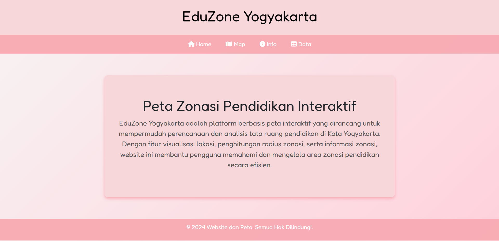
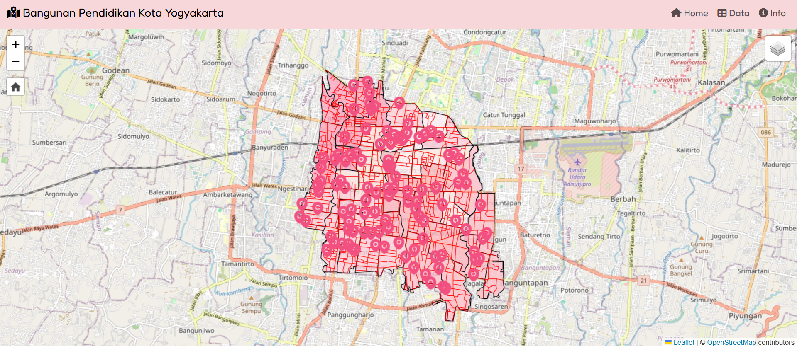
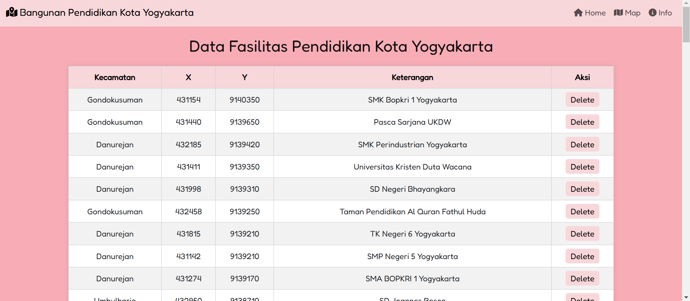

# EduZone Yogyakarta

EduZone Yogyakarta adalah sebuah platform berbasis peta interaktif yang dirancang untuk mempermudah perencanaan dan analisis tata ruang pendidikan di Kota Yogyakarta. Dengan fitur visualisasi lokasi, penghitungan radius zonasi, serta informasi zonasi, platform ini membantu pengguna memahami dan mengelola area zonasi pendidikan secara efisien.

### 1. Halaman Utama


## Fitur Utama

1. **Navigasi Sederhana**:
   - Terdapat navbar dengan beberapa tautan penting:
     - **Home**: Halaman utama dengan deskripsi singkat tentang platform.
     - **Map**: Akses ke peta interaktif.
     - **Info**: Informasi lebih lanjut mengenai platform.
     - **Data**: Tabel data terkait zonasi pendidikan.

2. **Desain Responsif**:
   - Halaman ini mendukung berbagai ukuran perangkat, mulai dari desktop hingga perangkat mobile.

3. **Peta Interaktif**:
   - Menggunakan library **Leaflet.js** untuk menampilkan peta interaktif dengan lokasi yang difokuskan di Kota Yogyakarta.
   - Menyediakan tampilan peta OpenStreetMap yang dapat diperbesar hingga detail tinggi.

4. **Modal Informasi Pembuat**:
   - Menyediakan informasi tentang pembuat platform, seperti nama, NIM, kelas, dan link GitHub.

5. **Footer Informasi Hak Cipta**:
   - Hak cipta dilindungi dengan copyright tahun 2024.

## Struktur File

### File Utama
- **homepage.html**:
  File utama yang berisi kode HTML untuk menampilkan halaman beranda platform EduZone Yogyakarta.

### CSS dan Plugin
- **Font Awesome**: Digunakan untuk ikon navigasi.
- **Bootstrap**: Digunakan untuk modal dan styling responsif.
- **Leaflet.js**: Digunakan untuk peta interaktif.
- **Leaflet Plugin**: Plugin tambahan untuk mendukung fitur pencarian dan kontrol peta.

### Folder Plugin (opsional)
- **plugin/leaflet-search-master**: Folder untuk plugin pencarian di Leaflet.
- **plugin/Leaflet.defaultextent-master**: Plugin untuk kontrol zoom dan reset extent.

## Cara Menggunakan

1. **Clone Repository**:
   ```bash
   git clone https://github.com/username/repository-name.git
   ```
2. **Buka File di Browser**:
   - Jalankan file `homepage.html` di browser favorit Anda untuk melihat halaman utama platform.

3. **Interaksi dengan Peta**:
   - Akses halaman Map melalui navbar untuk menggunakan peta interaktif.

## Teknologi yang Digunakan

- **HTML5**: Struktur utama halaman.
- **CSS3**: Styling halaman.
- **Bootstrap**: Library front-end untuk modal dan tata letak responsif.
- **Font Awesome**: Untuk ikon navigasi.
- **Leaflet.js**: Library untuk peta interaktif.
- **Google Fonts**: Menggunakan font "Fredoka" untuk gaya teks.

---

### 2. Peta Interaktif


## Fitur Utama
1. **Peta Interaktif**
   - Menampilkan basemap dari OpenStreetMap.
   - Dilengkapi dengan fitur zoom dan navigasi.

2. **Layer GeoJSON**
   - **Bangunan Pendidikan**: Lokasi sekolah dan bangunan pendidikan lainnya di Kota Yogyakarta dengan ikon khusus dan radius buffer.
   - **Jalan**: Pola jalan dengan informasi panjang dan fungsi jalan.
   - **Batas Administrasi**: Poligon kecamatan dan desa dengan simbolisasi warna berbeda.

3. **Fitur Interaktif**
   - Pop-up informasi saat objek pada peta diklik.
   - Tooltip pada objek untuk menampilkan informasi singkat.
   - Buffer radius 1.5 km di sekitar bangunan pendidikan yang dipilih.

4. **Kontrol Layer**
   - Opsi untuk menyalakan atau mematikan tampilan layer Bangunan Pendidikan, Jalan, atau Batas Administrasi.

5. **Fitur Pencarian**
   - Pencarian berdasarkan nama kecamatan menggunakan plugin `leaflet-search`.

6. **Default Extent**
   - Tombol untuk mengembalikan tampilan peta ke posisi awal (Yogyakarta).

7. **Watermark**
   - Menampilkan logo SV di bagian kiri bawah sebagai identitas pembuat.

8. **Informasi Pembuat**
   - Modal berisi informasi pembuat aplikasi, seperti nama, NIM, kelas, dan GitHub.

---

## Struktur File
### 1. **File Utama**
- `index.html`: File utama yang menampilkan peta interaktif.

### 2. **Folder Data**
- `data/titikpdd.geojson`: Data GeoJSON untuk bangunan pendidikan.
- `data/jalanykk.geojson`: Data GeoJSON untuk jaringan jalan.
- `data/adminyk.geojson`: Data GeoJSON untuk batas administrasi Yogyakarta.

### 3. **Folder Plugin**
- `plugin/leaflet-search-master`: Plugin untuk fitur pencarian pada peta.
- `plugin/Leaflet.defaultextent-master`: Plugin untuk tombol Default Extent.

### 4. **Folder Icon**
- `icon/marker.png`: Ikon khusus untuk bangunan pendidikan.

### 5. **Folder Image**
- `image/logoSV.png`: Gambar watermark logo SV.

---

## Teknologi yang Digunakan
1. **Frontend**
   - HTML5
   - CSS3 (Bootstrap 5.3.3)
   - JavaScript (jQuery, Leaflet.js)

2. **Library & Plugin**
   - Leaflet.js untuk peta interaktif.
   - `leaflet-search` untuk fitur pencarian.
   - `leaflet.defaultextent` untuk tombol default extent.

---

### 3. Tabel Data Fasilitas Pendidikan


## Fitur Utama

### 1. Navbar Dinamis
- **Tautan cepat** ke halaman:
  - **Home**
  - **Map**
  - **Info**
- **Desain responsif** menggunakan **Bootstrap 5**.

### 2. Tampilan Data Fasilitas Pendidikan
- Menampilkan tabel data fasilitas pendidikan yang tersimpan di database **MySQL**.
- **Informasi dalam tabel:**
  - Kecamatan
  - Koordinat X dan Y
  - Keterangan
  - Aksi (hapus data)
- **Desain minimalis** dengan tema soft pink dan CSS kustom.

### 3. Fungsi Hapus Data
- Pengguna dapat menghapus data langsung melalui tombol **"Delete"**.
- **Konfirmasi penghapusan** untuk menghindari kesalahan.
- **Keamanan:** Menggunakan **prepared statements** untuk melindungi aplikasi dari serangan **SQL Injection**.

### 4. Backend dengan PHP dan MySQL
- Koneksi ke database `responsiweb`.
- Query untuk:
  - Menampilkan data dari tabel `pendidikan`.
  - Menghapus data dari tabel `pendidikan`.

### 5. Desain Responsif dan Modern
- Menggunakan Google Font **Fredoka** untuk tampilan yang bersih dan ramah pengguna.
- Tema warna **soft pink** untuk latar belakang dan elemen navigasi.

---

## Struktur Proyek

### 1. **Frontend**
- **HTML + CSS**: Mengelola antarmuka pengguna, termasuk navbar, tabel data, dan tombol aksi.
- Dependency Frontend:
  - **Bootstrap 5**
  - **Font Awesome**
  - **Google Fonts** - Fredoka

### 2. **Backend**
- **PHP**: Mengambil data dari database, menampilkan tabel data, dan menangani penghapusan data.

### 3. **Database**
Tabel `pendidikan` menyimpan data fasilitas pendidikan dengan struktur:
- `id` (integer, primary key)
- `kecamatan` (varchar)
- `x` (float)
- `y` (float)
- `keterangan` (varchar)

---

## Persyaratan Sistem

- **Server Web**: Apache atau Nginx.
- **Bahasa Pemrograman**: PHP (v7.4 atau lebih baru).
- **Database**: MySQL (v5.7 atau lebih baru).
- **Dependency Frontend**:
  - Bootstrap 5
  - Font Awesome
  - Google Fonts - Fredoka
